# Introduction - IDOR
---
**IDOR (Insecure Direct Object References)** is a security vulnerability in which a user is able to access and make changes to data of any other user present in the system. This will result in a serious security flaw in the web application. This attack is usually occur when the internal implementation object, without any validation mechanism which allows attackers to manipulate these references to access unauthorized data.

In this write up I will explain how i found IDOR vulnerability at <a href="https://filkom.ub.ac.id/apps" target="_blank" rel="noopener">Filkom Apps Website</a> that can leak the short semester pre-KRS data including what subject they take, the GPA, the student's detail (phone number, email, etc.), and proof of  pre-KRS payment.

This attack also reveals the storage patterns / identifiers for the data in the backend and database systems to the attacker. Knowledge of storage identifiers allows the attacker to launch an **enumeration attack**. An enumeration attack can be described as where the attacker builds a collection of valid identifiers using the discovered pattern and test them against the application.

# Proof of Concept
---
<figure>
<a href="Picture1.png">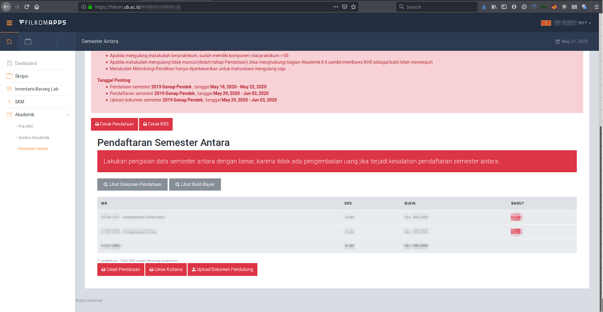</a>
<figcaption>Fig 1. Filkom Apps.</figcaption>
</figure>

This happened when I was opening the Filkom Apps website to fill in data for my short semester pre-KRS. After I fill in all the required data, I need to print out my document that i fill earlier with "Cetak Pendataan" menu 👇.

<figure>
<a href="Picture1dot2.png">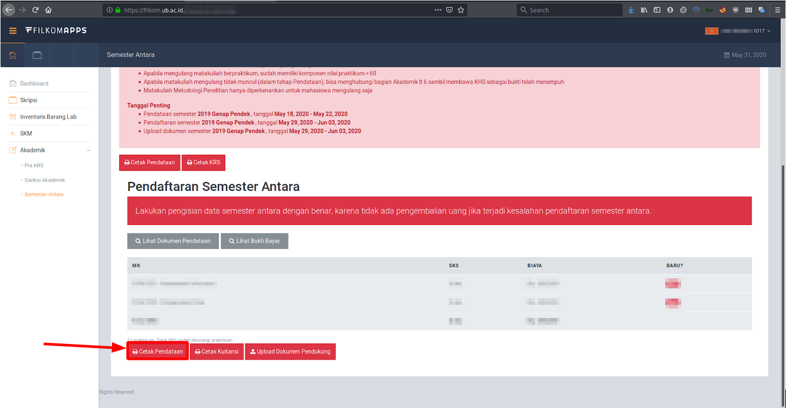</a>
<figcaption>Fig 2. Print short semester document.</figcaption>
</figure>

Then if I press the highlighted button, i got directed to the print page with my Nomor Induk Mahasiswa (NIM) number in the URL 👇.

<figure>
<a href="Picture2.png">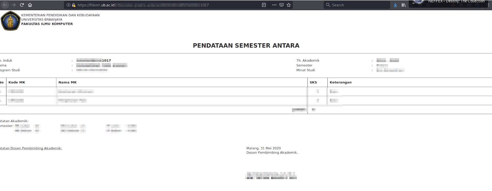</a>
<figcaption>Fig 3. Print pre-KRS page.</figcaption>
</figure>

I tried to enter another NIM number (besides my NIM) in the URL and run it in the browser. Here I will use the ***"xxxx1018"*** NIM. Turn out I can access other student's short semester pre-KRS data! It displays the student's GPA too!

<figure>
<a href="Picture3.png">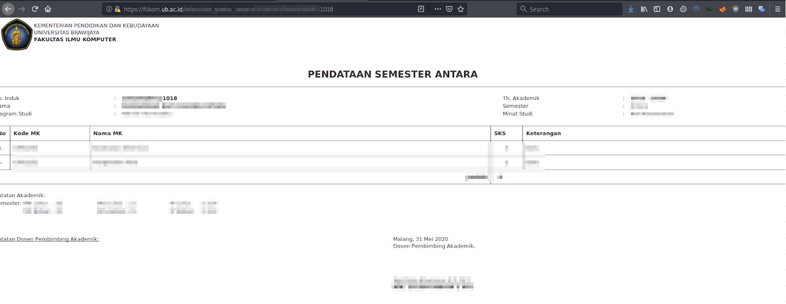</a>
<figcaption>Fig 4. Pre-KRS IDOR!</figcaption>
</figure>

Secondly, I encountered another IDOR vulnerability at the "Cetak Kuitansi" menu. 

<figure>
<a href="Picture4.png">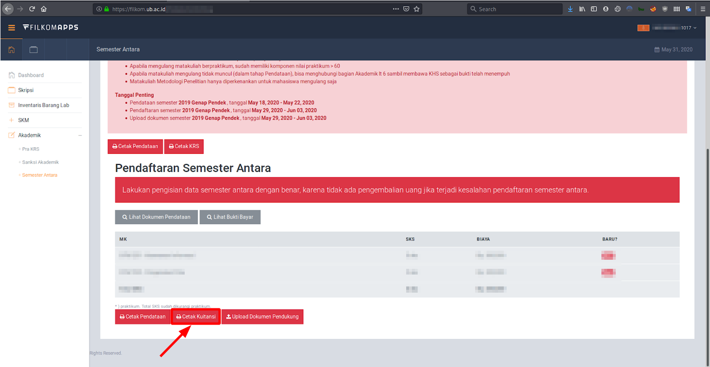</a>
<figcaption>Fig 5. "Cetak Kuitansi" menu.</figcaption>
</figure>

If I press the "Cetak Kuitansi" button, i got redirected to the print receipt page.

<figure>
<a href="Picture5.png">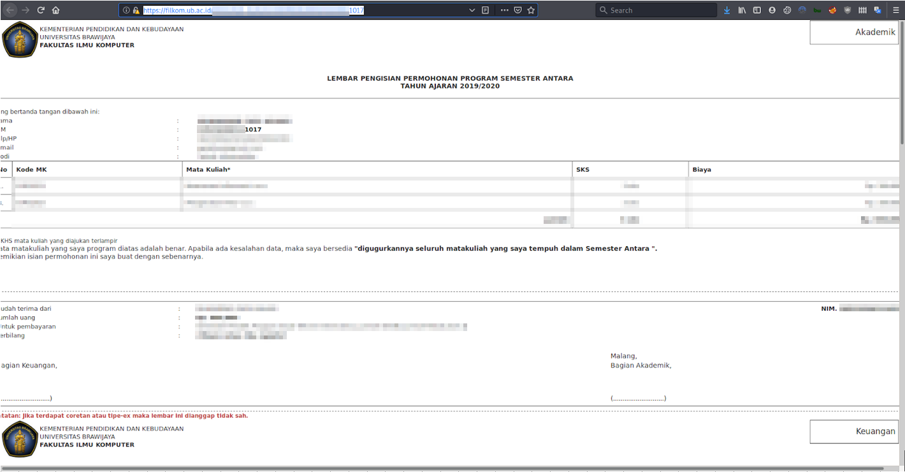</a>
<figcaption>Fig 6. Print receipt page.</figcaption>
</figure>

On that page there is a short semester application program form along with the short semester study plan card. The information shown above are student's NIM, name, study program, GPA of the previous semster, etc. and we can also see additional information in such a phone number and email.

Immediately, I changed my NIM to someone else's NIM. Here, I will use the previous NIM, "***xxxx1018"***. Again, I can access someone else's short semeser receipt through this IDOR vulnerability!

<figure>
<a href="Picture6.png">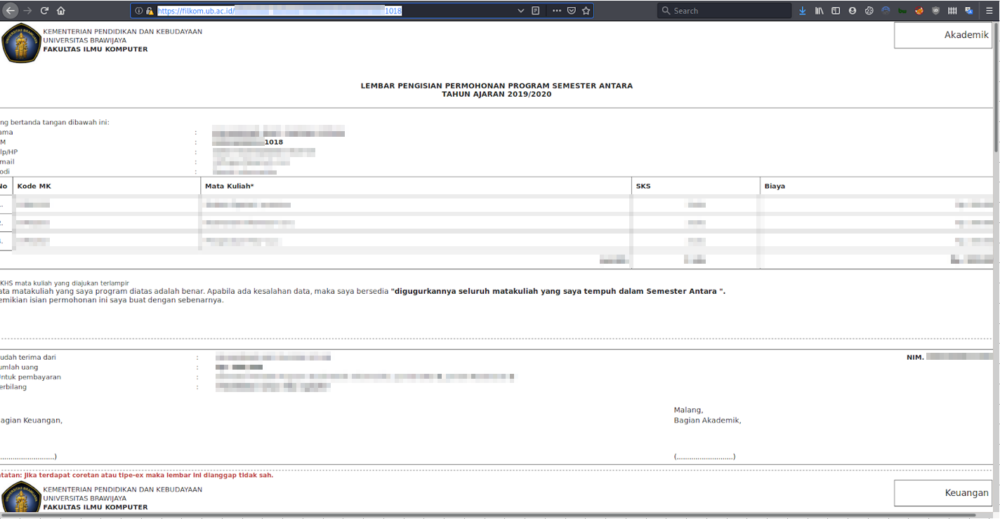</a>
<figcaption>Fig 7. Print receipt page IDOR.</figcaption>
</figure>

Furthermore, I also found IDOR when at the proof of payment menu. We can see the file we uploaded earlier (proof of payment, practicum value, etc.) by pressing the "Lihat ..." menu. Now I clicked to the "Lihat Bukti Bayar" menu that leads to another IDOR.

<figure>
<a href="Picture7.png">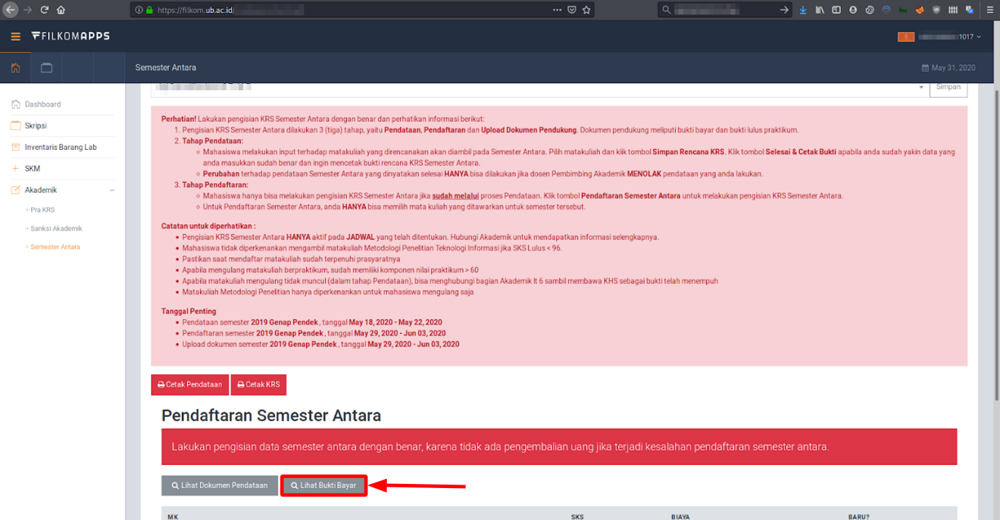</a>
<figcaption>Fig 8. "Lihat Bukti Bayar" button.</figcaption>
</figure>

I get a pop-up page containing the file we uploaded earlier (Proof of Payment file).

<figure>
<a href="Picture8.png">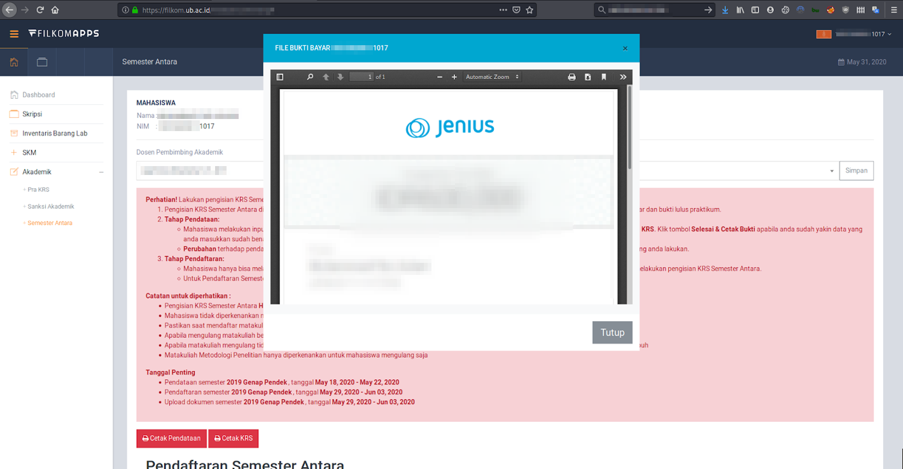</a>
<figcaption>Fig 9. Proof of Payment pop-up page.</figcaption>
</figure>

Then I observed the process that occurs between the two things above by using the **Developer Tools** on the Mozilla Firefox Browser by pressing the **F12** key.

<figure>
<a href="Picture9.png">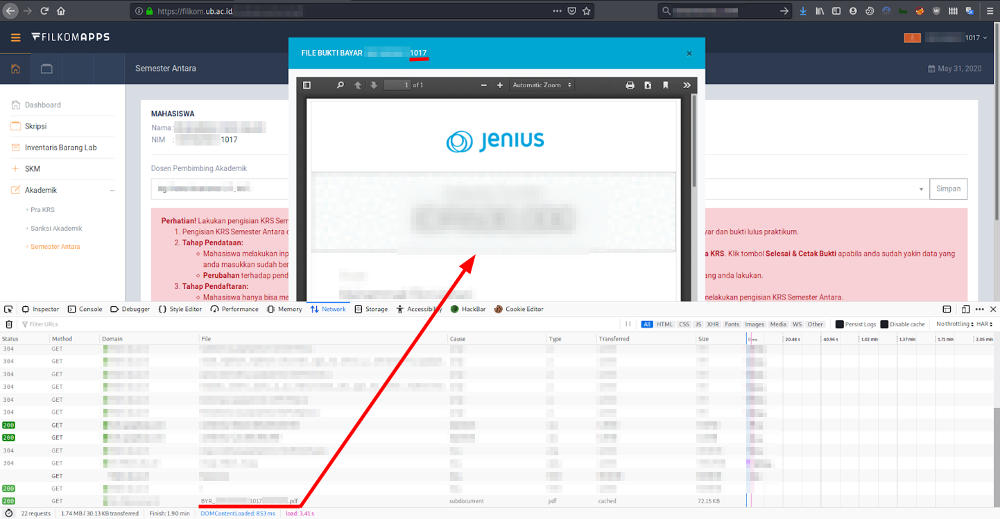</a>
<figcaption>Fig 10. Developer Tools.</figcaption>
</figure>

It turns out the browser will make a request to the URL below.
```
https://REDACTED/BYR_xxxx1017xxxx.pdf
``` 
It displays the contents of the page via pop-up page. If we follow the URL, we can see that the NIM number is being used again in the URL which allows us to do another IDOR!

<figure>
<a href="Picture10.png">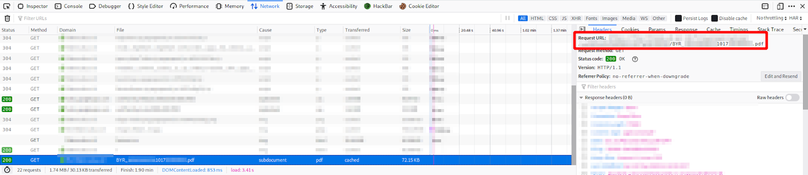</a>
<figcaption>Fig 11. Pop-up page.</figcaption>
</figure>

I changed the NIM number in the url and the payload results to below code.
```
https://REDACTED/BYR_xxxx1018xxxx.pdf
```
And it worked! We can see other student's Proof of Payment file!

<figure>
<a href="Picture11.png">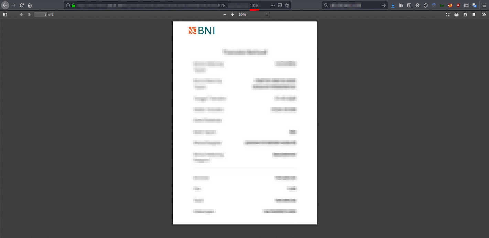</a>
<figcaption>Fig 12. Proof of Payment IDOR.</figcaption>
</figure>

# Conclusion
---
This is occured because of the internal implementation object without any validation mechanism. Thanks for reading my write-up!

