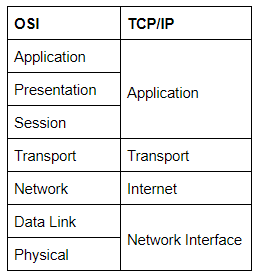

# [Introductory Networking](https://tryhackme.com/room/introtonetworking)
---
An introduction to networking theory and basic networking tools

## [Task 1] Introduction
---
## [Task 2] The OSI Model: An Overview
---
Cheatsheet: `PleaseDoNotThrowSausagePizzaAway` (PDNTSPA).

1. Physical → Data cables, cat6
2. Data → Switching, MAC address
3. Network → IP address, routing
4. Transport → TCP/UDP
5. Session → session management
6. Presentation → WMV, JPEG, MOV
7. Application → HTTP, SMTP

Which layer would choose to send data over TCP or UDP?
- **Layer 4**, it's the Transport Layer job.

Which layer checks received packets to make sure that they haven't been corrupted?
- **Layer 2**, because layer 2 receives a packet from the network layer (that includes the IP address for the remote computer) and adds in the physical (MAC) address of the receiving endpoint and need to make sure it's **not corrupted**.

In which layer would data be formatted in preparation for transmission?
- **Layer 2**, all the formatting jobs are on the Data Layer.

Which layer transmits and receives data?
- **Layer 1**, it's already clear.

Which layer encrypts, compresses, or otherwise transforms the initial data to give it a standardised format?
- **Layer 6**, the presentation layer translates the data into a standardised format, as well as handling any encryption, compression or other transformations to the data.

Which layer tracks communications between the host and receiving computers?
- **Layer 5**, the session layer is particularly important as the session that it creates is unique to the communication between endpoint.

Which layer accepts communication requests from applications?
- **Layer 7**, it works almost exclusively with applications, providing an interface for them to use in order to transmit data.

Which layer handles logical addressing?
- **Layer 3**, the network layer is responsible for locating the destination of our request, so it's handle logical addressing.

When sending data over TCP, what would you call the "bite-sized" pieces of data?
- **segments**, the transport layer then divides the transmission up into `bite-sized` pieces (over TCP these are called `segments`, over UDP they're called `datagrams`).

[Research] Which layer would the FTP protocol communicate with?
- **Layer 7**, it's often accessed with a special program called an FTP Client.

Which transport layer protocol would be best suited to transmit a live video?
- **UDP**, because UDP uses a simple transmission method without implied hand-shaking dialogues for ordering, reliability, or data integrity.

## [Task 3] Encapsulation
---
<figure>
<center><a href="encapsulation.jpeg"></a></center>
<figcaption>Encapsulation (from tryhackme).</figcaption>
</figure>

How would you refer to data at layer 2 of the encapsulation process (with the OSI model)?
- **Frames**.

How would you refer to data at layer 4 of the encapsulation process (with the OSI model), if the UDP protocol has been selected?
- **Datagrams**, as we can see the last task, UDP use "bite-sized" called `datagrams`.

What process would a computer perform on a received message?
- **de-encapsulation**. We need to reverse the encapsulation process by doing de-encapsulation.

Which is the only layer of the OSI model to add a trailer during encapsulation?
- **data link**, as the picture above.

Does encapsulation provide an extra layer of security (Aye/Nay)?
- **Aye**, of course by adding atrributes that should verified.

## [Task 4] The TCP/IP Model
---
The TCP/IP model is a few years older than OSI model, and serves as the basis for real-world networking. 
<figure>
<center><a href="tcpip.png"></a></center>
<figcaption>OSI and TCP/IP model (from tryhackme).</figcaption>
</figure>


Which model was introduced first, OSI or TCP/IP?
- **TCP/IP**.

Which layer of the TCP/IP model covers the functionality of the Transport layer of the OSI model (Full Name)?
- **transport**.

Which layer of the TCP/IP model covers the functionality of the Session layer of the OSI model (Full Name)?
- **Application**.

The Network Interface layer of the TCP/IP model covers the functionality of two layers in the OSI model. These layers are Data Link, and?.. (Full Name)?
- **physcial**.

Which layer of the TCP/IP model handles the functionality of the OSI network layer?
- **internet**.

What kind of protocol is TCP?
- **connection-based**.

What is SYN short for?
- **synchronise**.

What is the second step of the three way handshake?
- **syn/ack**.

What is the short name for the "Acknowledgement" segment in the three-way handshake?
- **ack**.

## [Task 5] Wireshark
---
What is the protocol specified in the section of the request that's linked to the Application layer of the OSI and TCP/IP Models?
- **domain name system**, u can get it by looking to Wireshark.
<figure>
<center><a href="dns.png"></a></center>
<figcaption>Domain Name System.</figcaption>
</figure>

Which layer of the OSI model does the section that shows the IP address "172.16.16.77" link to (Name of the layer)?
- **network**.

In the section of the request that links to the Transport layer of the OSI and TCP/IP models, which protocol is specified?
- **user datagram protocol**. DNS uses UDP for the transport mechanism.
<figure>
<center><a href="udp.png"></a></center>
<figcaption>DNS uses UDP.</figcaption>
</figure>

Over what medium has this request been made (linked to the Data Link layer of the OSI model)?
- **ethernet**.
<figure>
<center><a href="ethernet.png"></a></center>
<figcaption>Ethernet.</figcaption>
</figure>

Which layer of the OSI model does the section that shows the number of bytes transferred (81) link to?
- **physical**.
<figure>
<center><a href="phy.png"></a></center>
<figcaption>Physical.</figcaption>
</figure>

[Research] Can you figure out what kind of address is shown in the layer linked to the Data Link layer of the OSI model?
- **mac**, it's a mac address.

## [Task 6] [Networking Tools] Ping
---
The `ping` command is used when we want to test whether a connection to a remote resource is possible. Usually this will be a website on the internet, but it could also be for a computer on your home network if you want to check if it's configured correctly. `Ping` works using the ICMP protocol, which is one of the slightly less well-known TCP/IP protocols that I mentioned earlier. The ICMP protocol works on the Network layer of the OSI Model, and thus the Internet layer of the TCP/IP model. The basic syntax for `ping` is `ping <target>`.

What command would you use to ping the bbc.co.uk website?
```bash
┌──(kali㉿kali)-[~]
└─$ ping bbc.co.uk
PING bbc.co.uk (151.101.0.81) 56(84) bytes of data.
```

Ping muirlandoracle.co.uk. What is the IPv4 address?
```bash
┌──(kali㉿kali)-[~]
└─$ ping muirlandoracle.co.uk
PING muirlandoracle.co.uk (217.160.0.152) 56(84) bytes of data.
```
It's **217.160.0.152**.

What switch lets you change the interval of sent ping requests?
- **`-i`**, that stands for `interval`.

What switch would allow you to restrict requests to IPv4?
- **`-4`**, to use IPv4 only.

What switch would give you a more verbose output?
- **`-v`**. that stands for `verbose`.

## [Task 7] [Networking Tools] Traceroute
---
The internet is made up of many, many different servers and end-points, all networked up to each other. This means that, in order to get to the content you actually want, you first need to go through a bunch of other servers. Traceroute allows you to see each of these connections -- it allows you to see every intermediate step between your computer and the resource that you requested. The basic syntax for `traceroute` on Linux is this: `traceroute <destination>`.

Use traceroute on tryhackme.com. Can you see the path your request has taken?
```bash
┌──(kali㉿kali)-[~]
└─$ traceroute tryhackme.com                          
traceroute to tryhackme.com (104.26.10.229), 30 hops max, 60 byte packets
...
```

What switch would you use to specify an interface when using Traceroute?
- **`-i`**.

What switch would you use if you wanted to use TCP requests when tracing the route?
- **`-T`**.

[Lateral Thinking] Which layer of the TCP/IP model will traceroute run on by default (Windows)?
- **internet**.

## [Task 8] [Networking Tools] WHOIS
---
We can use `whois <domain>` command to get a list of available information about the domain registration. For example we perform a whois search on facebook.com:
```bash
┌──(kali㉿kali)-[~]
└─$ whois facebook.com
Domain Name: FACEBOOK.COM
...
Creation Date: 1997-03-29T05:00:00Z
...
Registrant Postal Code: 94025
>>> Last update of WHOIS database: 2021-01-06T11:00:18Z <<<
```

What is the registrant postal code for facebook.com?
- **94025**.

When was the facebook.com domain first registered?
- **29/03/1997**.

Perform a whois search on microsoft.com.
```bash
┌──(kali㉿kali)-[~]
└─$ whois microsoft.com
The Registry database contains ONLY .COM, .NET, .EDU domains and
Registrars.
Domain Name: microsoft.com
...
Registry Registrant ID: 
Registrant Name: Domain Administrator
Registrant Organization: Microsoft Corporation
Registrant Street: One Microsoft Way
Registrant City: Redmond
Registrant State/Province: WA
...
Tech Phone Ext: 
Tech Fax: +1.4259367329
Tech Fax Ext: 
Tech Email: msnhst@microsoft.com
...
```

[OSINT] What is the name of the golf course that is near the registrant address for microsoft.com?
- We can search the google map and then search for "golf" nearby.
<figure>
<center><a href="golf.png"></a></center>
<figcaption>Bellevue golf course.</figcaption>
</figure>

So we know it's **Bellevue golf course**.

What is the registered Tech Email for microsoft.com?
- **msnhst@microsoft.com**.

## [Task 9] [Networking Tools] Dig
---
When we visit a website in our web browser this all happens automatically, but we can also do it manually with a tool called `dig`. Like `ping` and `traceroute`, `dig` should be installed automatically on Linux systems.

Dig allows us to manually query recursive DNS servers of our choice for information about domains with the command `dig <domain> @<dns-server-ip>`.
```bash
# run this first if u don't have dig in your system
┌──(kali㉿kali)-[~]
└─$ sudo apt install dnsutils 

# run the dig command
──(kali㉿kali)-[~]
└─$ dig facebook.com
; <<>> DiG 9.16.8-Debian <<>> facebook.com
;; global options: +cmd
;; Got answer:
;; ->>HEADER<<- opcode: QUERY, status: NOERROR, id: 40978
;; flags: qr rd ra; QUERY: 1, ANSWER: 1, AUTHORITY: 0, ADDITIONAL: 1

;; OPT PSEUDOSECTION:
; EDNS: version: 0, flags:; MBZ: 0x0005, udp: 1280
;; QUESTION SECTION:
;facebook.com.                  IN      A

;; ANSWER SECTION:
facebook.com.           5       IN      A       157.240.208.35

;; Query time: 15 msec
;; SERVER: 192.168.40.2#53(192.168.40.2)
;; WHEN: Wed Jan 06 06:20:47 EST 2021
;; MSG SIZE  rcvd: 57
```

What is the first type of DNS server your computer would query when you search for a domain?
- **recursive**.

What type of DNS server contains records specific to domain extensions (i.e. .com, .co.uk*, etc)*? Use the long version of the name.
- **Top-Level Domain**.

Where is the very first place your computer would look to find the IP address of a domain?
- **local cache**.

[Research] Google runs two public DNS servers. One of them can be queried with the IP 8.8.8.8, what is the IP address of the other one?
- **8.8.4.4**.

If a DNS query has a TTL of 24 hours, what number would the dig query show?
- **86400**.

## [Task 10] Further Reading
---