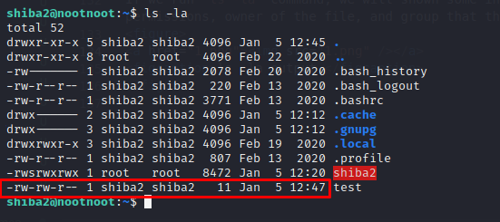
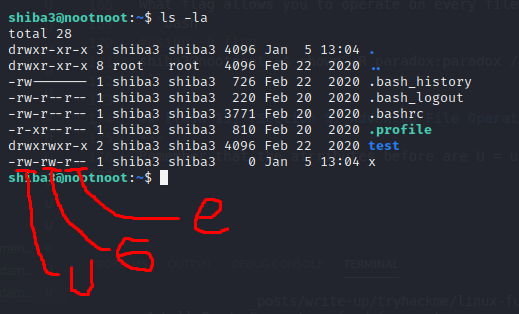

# [Linux Fundamentals Part 2](https://tryhackme.com/room/linux2)
---
Further adapt your Linux skills by understanding operators. Get hands-on and remotely access your own Linux machine to put your knowledge into use!

## [Task 1] Intro
---
Connect to TryHackMe OpenVPN first:
```bash
kali@kali:~$ sudo openvpn path-to/wuvel.ovpn
```

SSH to the machine with username: `shiba2` and password: `pinguftw`:
```bash
kali@kali:~$ ssh shiba2@10.10.51.128
```

## [Task 2] SSH - Intro
---
## [Task 3] Putty and SSH
---
## [Task 4] [Section 4: Linux Operators]: "&&"
---
`&&` means as you might expect "and". `&&` allows us to execute a second command after the first one has executed successfully. Only if the **first command** has executed successfully.
```bash
#failed case
shiba2@nootnoot:~$ ls adadwadawd && echo "A"
ls: cannot access 'adadwadawd': No such file or directory
#success case
shiba2@nootnoot:~$ ls && echo "A"
shiba2
A
```

## [Task 5] [Section 4: Linux Operators]: "&"
---
`&` is a background operator, meaning say we run a command that takes 10 seconds to run, we wouldn't be able to run commands during that period normally; however, with `&`, that command will still execute and we'll be able to run other commands.
```bash
shiba2@nootnoot:~$ sleep 5 &
[1] 1487  #send the sleep command to background task
shiba2@nootnoot:~$ ls
shiba2
```

## [Task 6] [Section 4: Linux Operators]: "$"
---
The `$` is an unusually special operator, as it is used to denote environment variables. These are variables set by the computer that are used to affect different processes and how they work. For example our current user is always stored in an environment variable called `$USER`. You can view these variables with the `echo` command.
```bash
shiba2@nootnoot:~$ echo $USER
shiba2
```

We can use `export <varname>=<value>` command to set an environment variable.
```bash
shiba2@nootnoot:~$ export nootnoot=1111
shiba2@nootnoot:~$ echo $nootnoot
1111
```

The value of the the machine home environment variable is:
```bash
shiba2@nootnoot:~$ echo $HOME
/home/shiba2
```

## [Task 7] [Section 4: Linux Operators]: "|"
---
`|` or pipe allows us to take the output of a command and use it as input for a second command.
```bash
shiba2@nootnoot:~$ ls | grep "shi" #list the file / directories and search for string "shi"
shiba2
```

## [Task 8] [Section 4: Linux Operators]: ";"
---
The `;` operator works a lot like `&&`, however it does not require the first command to execute successfully.
```bash
shiba2@nootnoot:~$ blabla; ls
blabla: command not found
shiba2
```

## [Task 9] [Section 4: Linux Operators]: ">"
---
`>` is the operator for output redirection. Meaning that we can redirect the output of any command to a file. We can output twenty to a "test" file by doing this command:
```bash
shiba2@nootnoot:~$ echo twenty > test
shiba2@nootnoot:~$ ls
shiba2  test
shiba2@nootnoot:~$ cat test 
twenty
```

## [Task 10] [Section 4: Linux Operators]: ">>"
---
`>>` does mainly the same thing as `>`, with one key difference. `>>` appends the output of a command to a file, instead of erasing it.
```bash
shiba2@nootnoot:~$ echo twenty > test
shiba2@nootnoot:~$ ls
shiba2  test
shiba2@nootnoot:~$ cat test 
twenty
shiba2@nootnoot:~$ echo two >> test
shiba2@nootnoot:~$ cat test 
twenty
two
```

## [Task 11] Binary - shiba2
---
The binary is checking to see if the environment variable "test1234" exists, and if it's set equal to the current $USER environment variable.
```bash
shiba2@nootnoot:~$ export test1234=$USER #create test1234 env with $USER value
shiba2@nootnoot:~$ echo $test1234
shiba2
shiba2@nootnoot:~$ ./shiba2 #run the binary
happynootnoises
```
shiba3's password is **happynootnoises**.

## [Task 12] [Section 5 - Advanced File Operations]: Intro
---
## [Task 13] [Section 5 - Advanced File Operators]: A bit of background.
---
If we run `ls -la` command, we will shown some information. These attributes are(in order) the file permissions, owner of the file, and group that the file is in.
<figure>
<center><a href="1.png"></a></center>
<figcaption>ls -la output.</figcaption>
</figure>

## [Task 14] [Section 5: Advanced File Operations]: chown
---
We can change the user or group of any file by using `chown user:group file` command if our user have **higher role** than that user.
```bash
shiba3@nootnoot:/home/shiba2$ ls -la
total 52
drwxr-xr-x 5 shiba2 shiba2 4096 Jan  5 12:45 .
drwxr-xr-x 8 root   root   4096 Feb 22  2020 ..
-rwsrwxrwx 1 root   root   8472 Jan  5 12:20 shiba2
-rw-rw-r-- 1 shiba2 shiba2   11 Jan  5 12:47 test #before

shiba3@nootnoot:/home/shiba2$ chown shiba3:shiba3 test 
shiba3@nootnoot:/home/shiba2$ ls -la
total 52
drwxr-xr-x 5 shiba2 shiba2 4096 Jan  5 12:45 .
drwxr-xr-x 8 root   root   4096 Feb 22  2020 ..
-rwsrwxrwx 1 root   root   8472 Jan  5 12:20 shiba2
-rw-rw-r-- 1 shiba3 shiba3   11 Jan  5 12:47 test #after
```

How would you change the owner of file to paradox?
```bash
shiba3@nootnoot:~$ chown paradox file
```

What about the owner and the group of file to paradox?
```bash
shiba3@nootnoot:~$ chown paradox:paradox file
```

What flag allows you to operate on every file in the directory at once?
```bash 
#using -R flag
shiba3@nootnoot:~$ chown -R paradox:paradox /etc
```

## [Task 15] [Section 5: Advanced File Operations]: chmod
---
We can use `chmod digits file` to change the permissions of the file / directory. Remember that the atrributes before are the permissions of the file. Each permissions using a three digit number, where each digit controls a specific permission, meaning the first digit controls the permissions for a user, the second digit controls the permission for a group, the third digit controls permissions for everyone that's not a part of the user or group. 

<figure>
<center><a href="2.png"></a></center>
<figcaption>U = user, G = group, E = everyone else.</figcaption>
</figure>

The way these values are calculated is this. The digit 1 means the file can be executed, the digit 2 means it can be written to, and the digit 4 means it can be read. You get the different permissions by adding these digits together. For example 1+2 is 3 meaning that file can be executed and written to.

What permissions mean the user can read the file, the group can read and write to the file, and no one else can read, write or execute the file?
```bash
460
# 4 -> user: read
# 6 -> group: 4 (read) + 2 (write)
# 0 -> other: none
```

What permissions mean the user can read, write, and execute the file, the group can read, write, and execute the file, and everyone else can read, write, and execute the file.
```bash
777
# 7 -> user: 4 (read), 2 (write), and (1)
# 7 -> group: 4 (read), 2 (write), and (1)
# 7 -> other: 4 (read), 2 (write), and (1)
```

## [Task 16] [Section 5: Advanced File Operations]: rm
---
We can remove a file by running `rm` command.
```bash
shiba3@nootnoot:~$ ls
test  x
shiba3@nootnoot:~$ rm x
shiba3@nootnoot:~$ ls
test
```

What flag deletes every file in a directory?
```bash
shiba3@nootnoot:/tmp/test$ ls
a  b
shiba3@nootnoot:/tmp/test$ rm -r /tmp/test/ #-r tag remove every file
shiba3@nootnoot:/tmp/test$ ls
shiba3@nootnoot:/tmp/test$
```

How do you suppress all warning prompts
```bash
shiba3@nootnoot:/tmp/test$ rm -f #-f tag suppress all warning prompts
```

## [Task 17] [Section 5: Advanced File Operations]: mv
---
We can use `mv <file> <destination>` to move files from one to another place.
```bash
shiba3@nootnoot:~/a$ ls
b
shiba3@nootnoot:~/a$ mv b ../ #moving file "b" to previous directory
shiba3@nootnoot:~/a$ ls ../ 
a  b  test
```

How would you move file to /tmp?
```bash
shiba3@nootnoot:~$ mv file /tmp
```

## [Task 18] Linux Fundamentals 3
---
Room completed!