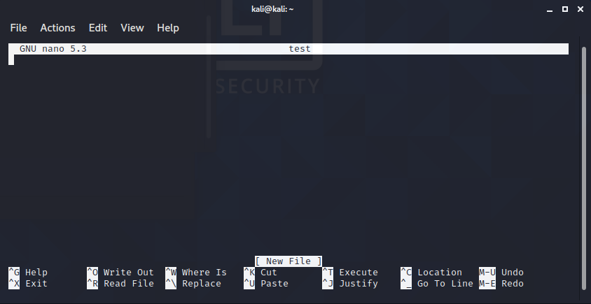

# [Linux Fundamentals Part 3](https://tryhackme.com/room/linux3)
---
Understand Linux advanced file operators, users & groups (permissions) and get an introduction to shell scripting; essential skills to have in cyber security.

## [Task 1] Intro
---
Connect to TryHackMe OpenVPN first:
```bash
┌──(kali㉿kali)-[~]
└─$ sudo openvpn path-to/wuvel.ovpn 
```

SSH to the machine with username: `shiba3` and password: `happynootnoises`:
```bash
┌──(kali㉿kali)-[~]
└─$ ssh shiba3@10.10.205.113 
```

## [Task 2] [Section 5: Advanced File Operations] - cp
---
We can use `cp <file> <destination>` command to copies (duplicates) the file.
```bash
shiba3@nootnoot:~$ ls
a  test
shiba3@nootnoot:~$ cp a a2
shiba3@nootnoot:~$ ls
a  a2  test
```

## [Task 3] [Section 5: Advanced File Operations] - cd && mkdir
---
Linux allows you to change the location of the current directory through the use of the `cd` command. The syntax of the `cd` command is this, `cd <directory>`.
```bash
shiba3@nootnoot:~$ ls
a  a2  test
shiba3@nootnoot:~$ cd .. #go to previous directory
shiba3@nootnoot:/home$ ls
noot  nootnoot  shiba1  shiba2  shiba3  shiba4
```

This brings us to `mkdir`, occasionally we'll want to make a new directory to store files in, and that is done using `mkdir`, the syntax of `mkdir` is `mkdir <directory name>`.
```bash
shiba3@nootnoot:~$ ls
a  a2  test
shiba3@nootnoot:~$ mkdir newFolder
shiba3@nootnoot:~$ ls
a  a2  newFolder  test
```

Using relative paths, we can `cd` to our home directory by doing this.
```bash
shiba3@nootnoot:~$ cd ~ 
```

Using absolute paths we can make a directory called test in /tmp by doing this.
```bash
shiba3@nootnoot:~$ mkdir /tmp/test
shiba3@nootnoot:~$ ls /tmp/
test
```

## [Task 4] [Section 5: Advanced File Operations] - ln
---
We can use `ln source destination` command to "hard linking", which completely duplicates the file, and links the duplicate to the original copy. Meaning What ever is done to the created link, is also done to the original file.
```bash
shiba3@nootnoot:~$ ln a2 a21
shiba3@nootnoot:~$ ls
a  a2  a21  newFolder  test
shiba3@nootnoot:~$ echo aa >> a2
shiba3@nootnoot:~$ cat a2
aa
shiba3@nootnoot:~$ cat a21
aa
```

The next form of linking is symbolic linking (symlink). While a hard linked file contains the data in the original file, a symbolic link is just a glorified reference. Meaning that the actual symbolic link has no data in it at all, it's just a reference to another file.

The syntax for a symbolic link is the exact same, but it uses the `-s` flag, so to create a symbolic link, we could run `ln -s <file> <destination>`.
```bash
shiba3@nootnoot:~$ ls
newFolder  test
shiba3@nootnoot:~$ ln -s a b
shiba3@nootnoot:~$ ls -la
total 40
drwxr-xr-x 6 shiba3 shiba3 4096 Jan  6 08:28 .
drwxr-xr-x 8 root   root   4096 Feb 22  2020 ..
lrwxrwxrwx 1 shiba3 shiba3    1 Jan  6 08:28 b -> a
drwxrwxr-x 2 shiba3 shiba3 4096 Feb 22  2020 test
```

We can link /home/test/testfile to /tmp/test by doing this.
```bash
shiba3@nootnoot:~$ ln /home/test/testfile /tmp/test
```

## [Task 5] [Section 5: Advanced File Operations] - find
---
`find` is an incredibly powerful, but incredibly simple command. It allows you to do just as it says, find files. It does this by listing every file in the current directory, so if you ran `find /tmp` it would list every file in `/tmp`.
```bash
shiba3@nootnoot:~$ find /tmp
/tmp
/tmp/.XIM-unix
/tmp/.X11-unix
/tmp/test
...
```

We can use `find dir -user` , to list every file owned by a specific user; we can use `find dir -group` to list every file owned by a specific group.
```bash
#user
shiba3@nootnoot:~$ find / -user shiba1
find: ‘/var/log/unattended-upgrades’: Permission denied
...
/home/shiba1
/home/shiba1/.profile
/home/shiba1/.gnupg
...

#group
shiba3@nootnoot:~$ find / -group shiba1
find: ‘/var/log/unattended-upgrades’: Permission denied
...
/home/shiba1
/home/shiba1/.profile
/home/shiba1/.gnupg
...
```

We can find files that have specific permissions by using **`-perm`** flag.
```bash
shiba3@nootnoot:~$ find directory -perm 777
```

We can find all the files in `/home` directory with:
```bash
shiba3@nootnoot:~$ find /home
```

We can find all the files owned by `paradox` on the whole system with:
```bash
shiba3@nootnoot:~$ find / -user paradox
```

## [Task 6] [Section 5: Advanced File Operations] - grep
---
`grep` arguably the best way to narrow the output down to better find what we looking for. The syntax of the command is `grep <string or regex> <file>`, however `file` is optional if we're using piping (`|`).
```bash
shiba3@nootnoot:~$ find / | grep "shiba3"
/etc/shiba/shiba3
```

We can use `-n` flag to lists line numbers for every string found.
```bash
shiba3@nootnoot:~$ grep "hel" ape -n
2:hello
```

We can search for the string `boop` in the file `aaaa` in the directory `/tmp` with:
```bash
shiba3@nootnoot:~$ grep boop /tmp/aaaa
```

## [Task 7] Binary - Shiba3
---

The first step is actually finding the binary, I'm not heartless though, so I'll give you the name of the binary. The name of the binary is shiba4.
```bash
shiba3@nootnoot:~$ find /* | grep "shiba4"
/etc/shiba/shiba4
...
/opt/secret/shiba4
...
```

The actual binary will check for two things, it will be checking that there's a directory called test in your home directory, how you create that is up to you. It will also be checking that inside the directory there's a file called test1234.
```bash
shiba3@nootnoot:~$ mkdir test
shiba3@nootnoot:~$ ls
ape  test  test1234
shiba3@nootnoot:~$ cd test/
shiba3@nootnoot:~/test$ touch test1234
shiba3@nootnoot:~/test$ ls
test1234
shiba3@nootnoot:~/test$ cd /opt/secret/
shiba3@nootnoot:/opt/secret$ ./shiba4 
test1234
```

Yeay! The shiba4's password is **test1234**.

## [Task 8] [Section 6: Miscellaneous]: Intro
---
## [Task 9] [Section 6: Miscellaneous]: sudo
---
`sudo` is Linux's run as administrator button, and the syntax goes `sudo <command>`.
```bash
shiba3@nootnoot:~$ sudo ls
[sudo] password for shiba3: 
shiba3 is not in the sudoers file.  This incident will be reported.
#user shiba3 must be in the sudoers file to run sudo command
```

We can use `-u` flag to specify which user we want to run a command as.
```bash
shiba3@nootnoot:~$ sudo -u shiba4 ls
```

We can run `whoami` command as user jen with:
```bash
shiba3@nootnoot:~$ sudo -u jen whoami
```

We can list our current sudo privileges (what commands we can run, who we can run them as etc.) with `-l` flag.
```bash
┌──(kali㉿kali)-[~]
└─$ sudo -l                                                                                     
[sudo] password for kali: 
Matching Defaults entries for kali on kali:
    env_reset, mail_badpass,
    secure_path=/usr/local/sbin\:/usr/local/bin\:/usr/sbin\:/usr/bin\:/sbin\:/bin

User kali may run the following commands on kali:
    (ALL : ALL) ALL
```

## [Task 10] [Section 6: Miscellaneous]: Adding users and groups
---
Linux provides a nice helpful way create user and group with `adduser` and `addgroup`. The syntax for both of these commands are `adduser username` and `addgroup groupname`.
```bash
┌──(kali㉿kali)-[~]
└─$ sudo adduser test

┌──(kali㉿kali)-[~]
└─$ sudo addgroup test2
```

We also can add a user to a group. That is done with the `usermod` command, the syntax for that is `usermod -a -G <groups seperated by commas> <user>`.

We can add the user test to the group test with:
```bash
┌──(kali㉿kali)-[~]
└─$ sudo usermod -a -G test test
```

## [Task 11] [Section 6: Miscellaneous]: nano
---
`nano` is a terminal based text editor. The syntax for nano is `nano <file we want to write to>`.
```bash 
┌──(kali㉿kali)-[~]
└─$ nano test
```

It show us new prompt to `nano` GUI.
<figure>
<center><a href="3.png"></a></center>
<figcaption>nano's GUI.</figcaption>
</figure>

We type something and press `ctrl+x` to save the file and press Y and we'll be asked what you want to name the file and press ENTER if we already done.

## [Task 12] [Section 6: Miscellaneous]: Basic shell scripting
---
We can learn more about basic bash scripting in this [website](https://devhints.io/bash).

## [Task 13] [Section 6: Miscellaneous]: Important Files and Directories
---

Here are the important files and directories:
- `/etc/passwd` - Stores user information - Often used to see all the users on a system.
- `/etc/shadow` - Has all the passwords of these users.
- `/etc/sudoers` - Used to control the sudo permissions of every user on the system.
- `/home` - The directory where all your downloads, documents etc are. - The equivalent on Windows is `C:\Users\<user>`.
- `/root` - The root user's home directory - The equivilent on Windows is `C:\Users\Administrator`.
- `/usr` - Where all your software is installed.
- `/bin` and `/sbin` - Used for system critical files - **DO NOT DELETE**.
- `/var` - The Linux miscellaneous directory, a myriad of processes store data in `/var`.
- `$PATH` - Stores all the binaries you're able to run - same as `$PATH` on Windows.

## [Task 14] [Section 6: Miscellaneous]: Installing packages(apt)
---
A package is essentially a program, you can think of it like an exe file on windows. To install packages we need root permissions, as each package will likely modify some system critical directories such as `/usr`. The syntax to install packages is `apt install package`.
```bash
┌──(kali㉿kali)-[~]
└─$ sudo apt install code #install visual studio code
```

## [Task 15] [Section 6: Miscellaneous]: Processes
---
Every binary we execute on linux, is a process while it's run. A process is just another word for a running program. A list of user created processes can be viewed with the `ps` command.
```bash
┌──(kali㉿kali)-[~]
└─$ ps -a                                                                                     255 
    PID TTY          TIME CMD
   1408 pts/0    00:00:05 vmtoolsd
  12747 pts/1    00:00:09 ruby2.7
  12947 pts/0    00:00:00 sudo
  12948 pts/0    00:00:01 openvpn
  14182 pts/3    00:00:00 ps
```