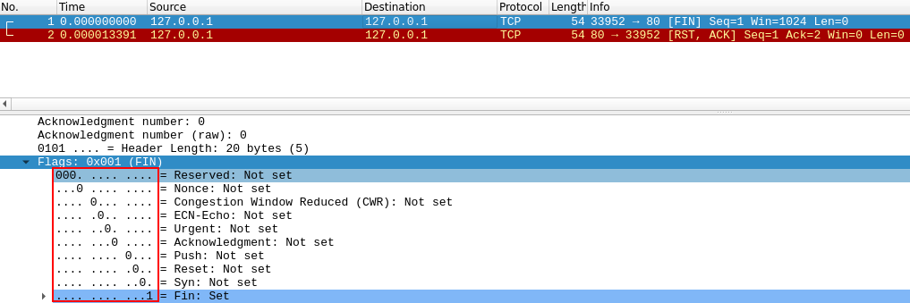

# [Nmap](https://tryhackme.com/room/furthernmap)
---
---
---
---
---
An in depth look at scanning with Nmap, a powerful network scanning tool.

## Deploy
---
---
---
## Introduction
---
---
---
What networking constructs are used to direct traffic to the right application on a server?
- **ports**.

How many of these are available on any network-enabled computer?
- **65535**.

[Research] How many of these are considered "well-known"? (These are the "standard" numbers mentioned in the task).
- **1024**.

## Nmap Switches
---
---
---
What is the first switch listed in the help menu for a 'Syn Scan' (more on this later!)?
- **`-Ss`**.

Which switch would you use for a "UDP scan"?
- **`-sU`**.

If you wanted to detect which operating system the target is running on, which switch would you use?
- **`-o`**.

Nmap provides a switch to detect the version of the services running on the target. What is this switch?
- **`-sV`**.

The default output provided by nmap often does not provide enough information for a pentester. How would you increase the verbosity?
- **`-v`**.

Verbosity level one is good, but verbosity level two is better! How would you set the verbosity level to two? (Note: it's highly advisable to always use at least this option)
- **`-vv`**.

What switch would you use to save the nmap results in three major formats?
- **`-oA`**.

What switch would you use to save the nmap results in a "normal" format?
- **`-oN`**.

A very useful output format: how would you save results in a "grepable" format?
- **`-oG`**.

How would you activate this setting ("aggressive" mode)?
- **`-A`**.

How would you set the timing template to level 5?
- **`-T5`**.

How would you tell nmap to only scan port 80?
- **`-p 80`**.

How would you tell nmap to scan ports 1000-1500?
- **`-p 1000-1500`**.

How would you tell nmap to scan all ports?
- **`-p-`**.

How would you activate a script from the nmap scripting library (lots more on this later!)?
- **`--script`**.

How would you activate all of the scripts in the "vuln" category?
- **`--script=vuln`**.

## [Scan Types] Overview
---
---
---
When port scanning with Nmap, there are three basic scan types. These are:
1. TCP Connect Scans (`-sT`)
2. SYN "Half-open" Scans (`-sS`)
3. UDP Scans (`-sU`)

Additionally there are several less common port scan types, some of which we will also cover (albeit in less detail). These are:

1. TCP Null Scans (`-sN`)
2. TCP FIN Scans (`-sF`)
3. TCP Xmas Scans (`-s`)

## [Scan Types] TCP Connect Scans
---
---
---
[RFC 793](https://tools.ietf.org/html/rfc793) states that:
> ... If the connection does not exist (CLOSED) then a reset is sent in response to any incoming segment except another reset.  In particular, SYNs addressed to a non-existent connection are rejected by this means.

In other words, if Nmap sends a TCP request with the `SYN` flag set to a closed port, the target server will respond with a TCP packet with the `RST` (Reset) flag set. By this response, Nmap can establish that the port is closed.

Which RFC defines the appropriate behaviour for the TCP protocol?
- **rfc 793**.

If a port is closed, which flag should the server send back to indicate this?
- **rst**.

## [Scan Types] SYN Scans
---
---
---
SYN scans are used to scan the TCP port-range of a target or targets; however, the two scan types work slightly differently. SYN scans are sometimes referred to as "Half-open" scans, or "Stealth" scans.

Where TCP scans perform a full three-way handshake with the target, SYN scans sends back a `RST` TCP packet after receiving a `SYN/ACK` from the server (this prevents the server from repeatedly trying to make the request). 

There are two other names for a SYN scan, what are they?
- **Half-open,stealth**.

Can Nmap use a SYN scan without Sudo permissions (Y/N)?
- **N**.

## [Scan Types] UDP Scans
---
---
---
When a packet is sent to an open UDP port, there should be no response. When this happens, Nmap refers to the port as being `open|filtered`. In other words, it suspects that the port is open, but it could be firewalled. If it gets a UDP response (which is very unusual), then the port is marked as open. More commonly there is no response, in which case the request is sent a second time as a double-check. If there is still no response then the port is marked `open|filtered` and Nmap moves on.

When a packet is sent to a closed UDP port, the target should respond with an ICMP (ping) packet containing a message that the port is unreachable. This clearly identifies closed ports, which Nmap marks as such and moves on.

If a UDP port doesn't respond to an Nmap scan, what will it be marked as?
+ **open or filtered**. Subtitute `or` with `|`.

When a UDP port is closed, by convention the target should send back a "port unreachable" message. Which protocol would it use to do so?
- **icmp**.


## [Scan Types] NULL, FIN and Xmas
---
---
---
NULL, FIN and Xmas TCP port scans are less commonly used than any of the others we've covered already, so we will not go into a huge amount of depth here. All three are interlinked and are used primarily as they tend to be even stealthier, relatively speaking, than a SYN "stealth" scan. Beginning with NULL scans:
- As the name suggests, NULL scans (`-sN`) are when the TCP request is sent with no flags set at all. As per the RFC, the target host should respond with a RST if the port is closed.
<figure>
<center><a href="null.png"></a></center>
<figcaption>NULL scans (from tryhackme).</figcaption>
</figure>

- FIN scans (`-sF`) work in an almost identical fashion; however, instead of sending a completely empty packet, a request is sent with the FIN flag (usually used to gracefully close an active connection). Once again, Nmap expects a RST if the port is closed.
<figure>
<center><a href="fin.png"></a></center>
<figcaption>FIN scans (from tryhackme).</figcaption>
</figure>

- As with the other two scans in this class, Xmas scans (`-sX`) send a malformed TCP packet and expects a RST response for closed ports. It's referred to as an xmas scan as the flags that it sets (PSH, URG and FIN) give it the appearance of a blinking christmas tree when viewed as a packet capture in Wireshark.

<figure>
<center><a href="xmas.png"></a></center>
<figcaption>xmas scans (from tryhackme).</figcaption>
</figure>

Which of the three shown scan types uses the URG flag?
- **xmas**.

Why are NULL, FIN and Xmas scans generally used?
- **Firewall Evasion**.

Which common OS may respond to a NULL, FIN or Xmas scan with a RST for every port?
- **Microsoft Windows**.

## [Scan Types] ICMP Network Scanning
---
---
---
If we want to see which IP addresses contain active hosts, and which do not, we can do this is by using Nmap to perform a so called "ping sweep". This is exactly as the name suggests: Nmap sends an ICMP packet to each possible IP address for the specified network. When it receives a response, it marks the IP address that responded as being alive. For reasons we'll see in a later task, this is not always accurate; however, it can provide something of a baseline and thus is worth covering.

To perform a ping sweep, we use the `-sn` switch in conjunction with IP ranges which can be specified with either a hypen (`-`) or CIDR notation. The `-sn` switch tells Nmap not to scan any ports -> forcing it to rely purely on ICMP packets (or ARP requests on a local network) to identify targets.

We could scan the 192.168.0.x network using:

```bash
$ nmap -sn 192.168.0.1-254
```
or
```bash
$ nmap -sn 192.168.0.0/24
```

How would you perform a ping sweep on the 172.16.x.x network (Netmask: 255.255.0.0) using Nmap? (CIDR notation).
```bash
$ nmap -sn 172.16.0.0/16 
# CIDR 16 -> only 16 digits last that we're gonna used 1-254
```

## [NSE Scripts] Overview
---
---
---
The Nmap Scripting Engine (NSE) is an incredibly powerful addition to Nmap, extending its functionality quite considerably. NSE Scripts are written in the `Lua` programming language, and can be used to do a variety of things: from scanning for vulnerabilities, to automating exploits for them. The NSE is particularly useful for reconnaisance, however, it is well worth bearing in mind how extensive the script library is.

There are many categories available. Some useful categories include:
- `safe`:- Won't affect the target
- `intrusive`:- Not safe: likely to affect the target
- `vuln`:- Scan for vulnerabilities
- `exploit`:- Attempt to exploit a vulnerability
- `auth`:- Attempt to bypass authentication for running services (e.g. Log into an FTP server anonymously)
- `brute`:- Attempt to bruteforce credentials for running services
- `discovery`:- Attempt to query running services for further information about the network (e.g. query an SNMP server).

What language are NSE scripts written in?
- **lua**.

Which category of scripts would be a very bad idea to run in a production environment?
- **intrusive**.

## [NSE Scripts] Working with the NSE
---
---
---
To run a specific script, we would use `--script=<script-name>` , e.g. `--script=http-fileupload-exploiter`. Nmap scripts come with built-in help menus, which can be accessed using `nmap --script-help <script-name>`.

What optional argument can the `ftp-anon.nse` script take?
```bash
$ nmap -sV -sC <target>

PORT   STATE SERVICE
21/tcp open  ftp
| ftp-anon: Anonymous FTP login allowed (FTP code 230)
| -rw-r--r--   1 1170     924            31 Mar 28  2001 .banner
| d--x--x--x   2 root     root         1024 Jan 14  2002 bin
| d--x--x--x   2 root     root         1024 Aug 10  1999 etc
| drwxr-srwt   2 1170     924          2048 Jul 19 18:48 incoming [NSE: writeable]
| d--x--x--x   2 root     root         1024 Jan 14  2002 lib
| drwxr-sr-x   2 1170     924          1024 Aug  5  2004 pub
|_Only 6 shown. Use --script-args ftp-anon.maxlist=-1 to see all.
```

It used **maxlist** optional argument.


## [NSE Scripts] Searching for Scripts
---
---
---
We can search for nmap's scripts from the [Nmap website](https://nmap.org/nsedoc/index.html) or from local storage at `/usr/share/nmap/scripts`. There's two ways to search for scripts:
- Using `grep`:
```bash
$ grep "ftp" /usr/share/nmap/scripts/script.db
```

- Using `ls`.
```bash
$ ls -l /usr/share/nmap/scripts/*ftp*
```

Search for "smb" scripts in the `/usr/share/nmap/scripts/` directory using either of the demonstrated methods. What is the filename of the script which determines the underlying OS of the SMB server?
```bash
$ grep "smb" /usr/share/nmap/scripts/script.db 
...
Entry { filename = "smb-os-discovery.nse", categories = { "default", "discovery", "safe", } }
...
```

Read through this script. What does it depend on?
```bash
$ cat /usr/share/nmap/scripts/smb-os-discovery.nse | grep "dependenc" 
dependencies = {"smb-brute"}
```

## Firewall Evasion
---
---
---
Nmap provides an option for this: `-Pn`, which tells Nmap to not bother pinging the host before scanning it. This means that Nmap will always treat the target host(s) as being alive, effectively bypassing the ICMP block; however, it comes at the price of potentially taking a very long time to complete the scan (if the host really is dead then Nmap will still be checking and double checking every specified port).

Which simple (and frequently relied upon) protocol is often blocked, requiring the use of the `-Pn` switch?
- **icmp**.

[Research] Which Nmap switch allows you to append an arbitrary length of random data to the end of packets?
- **--data-length**. From this [website](https://nmap.org/book/man-bypass-firewalls-ids.html).

## Practical
---
---
---
Does the target (10.10.37.245)respond to ICMP (ping) requests (Y/N)?
```bash
┌──(kali㉿kali)-[~/Desktop]
└─$ nmap -sP -PE 10.10.37.245 
Warning:  You are not root -- using TCP pingscan rather than ICMP
Starting Nmap 7.91 ( https://nmap.org ) at 2021-01-06 10:43 EST
Note: Host seems down. If it is really up, but blocking our ping probes, try -Pn
Nmap done: 1 IP address (0 hosts up) scanned in 2.03 seconds
```
It's blocked or ping request, **N**.

Perform an Xmas scan on the first 999 ports of the target -- how many ports are shown to be open or filtered?
```bash
┌──(kali㉿kali)-[~/Desktop]
└─$ sudo nmap -sX -p 0-1000 10.10.37.245                                                        1 ⨯
[sudo] password for kali: 
Starting Nmap 7.91 ( https://nmap.org ) at 2021-01-06 10:45 EST
Nmap scan report for 10.10.37.245
Host is up (0.00018s latency).
All 1001 scanned ports on 10.10.37.245 are open|filtered

Nmap done: 1 IP address (1 host up) scanned in 17.68 seconds
```
All ports (1-999) are filtered. So it's **999** ports.

There is a reason given for this -- what is it?
```bash
┌──(kali㉿kali)-[~/Desktop]
└─$ sudo nmap -vv -- 10.10.37.245                                                             130 ⨯
Starting Nmap 7.91 ( https://nmap.org ) at 2021-01-06 10:49 EST
Initiating Ping Scan at 10:49
Scanning 10.10.37.245 [4 ports]
Completed Ping Scan at 10:49, 0.05s elapsed (1 total hosts)
Initiating Parallel DNS resolution of 1 host. at 10:49
Completed Parallel DNS resolution of 1 host. at 10:49, 13.02s elapsed
Initiating SYN Stealth Scan at 10:49
Scanning 10.10.37.245 [1000 ports]
Discovered open port 21/tcp on 10.10.37.245
Discovered open port 1723/tcp on 10.10.37.245
Discovered open port 587/tcp on 10.10.37.245
Completed SYN Stealth Scan at 10:49, 5.28s elapsed (1000 total ports)
Nmap scan report for 10.10.37.245
Host is up, received reset ttl 128 (0.0030s latency).
Scanned at 2021-01-06 10:49:37 EST for 18s
Not shown: 997 filtered ports
Reason: 997 no-responses # this is the answer (no response)
PORT     STATE SERVICE    REASON
21/tcp   open  ftp        syn-ack ttl 128
587/tcp  open  submission syn-ack ttl 128
1723/tcp open  pptp       syn-ack ttl 128

Read data files from: /usr/bin/../share/nmap
Nmap done: 1 IP address (1 host up) scanned in 18.55 seconds
           Raw packets sent: 2004 (88.140KB) | Rcvd: 7 (292B)
```

Perform a TCP SYN scan on the first 5000 ports of the target -- how many ports are shown to be open?
```bash
┌──(kali㉿kali)-[~/Desktop]
└─$ sudo nmap -sS -p 0-5000 10.10.37.245  
PORT     STATE SERVICE    REASON
21/tcp   open  ftp        syn-ack ttl 128
587/tcp  open  submission syn-ack ttl 128
1723/tcp open  pptp       syn-ack ttl 128
... # the rest of 2 are gone, it's total 5 ports open
````

Open Wireshark (see [Wireshark](https://tryhackme.com/room/wireshark) Room for instructions) and perform a TCP Connect scan against port 80 on the target, monitoring the results. Make sure you understand what is going on.

<figure>
<center><a href="hasil.png"></a></center>
<figcaption>RST at Wireshark.</figcaption>
</figure>

Deploy the `ftp-anon` script against the box. Can Nmap login successfully to the FTP server on port 21? (Y/N).
```bash
┌──(kali㉿kali)-[~/Desktop]
└─$ nmap --script=ftp-anon.nse -p 21 10.10.6.105                                                1 ⨯
Starting Nmap 7.91 ( https://nmap.org ) at 2021-01-06 11:15 EST
Nmap scan report for 10.10.6.105
Host is up (0.20s latency).

PORT   STATE SERVICE
21/tcp open  ftp
| ftp-anon: Anonymous FTP login allowed (FTP code 230)
|_Can't get directory listing: TIMEOUT

Nmap done: 1 IP address (1 host up) scanned in 44.56 seconds
```
**Y**es we can!

## Conclusion
---
---
---
We have now completed the Further Nmap room -- hopefully you enjoyed it, and learnt something new!