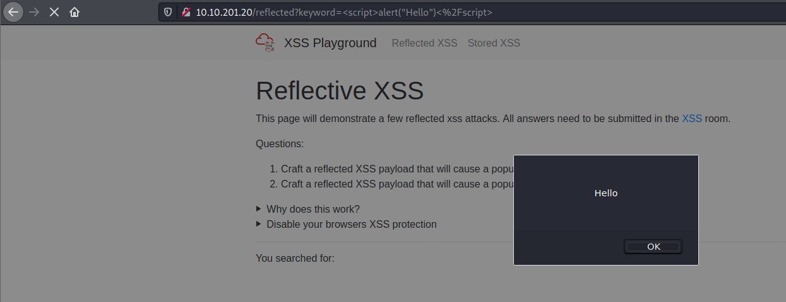
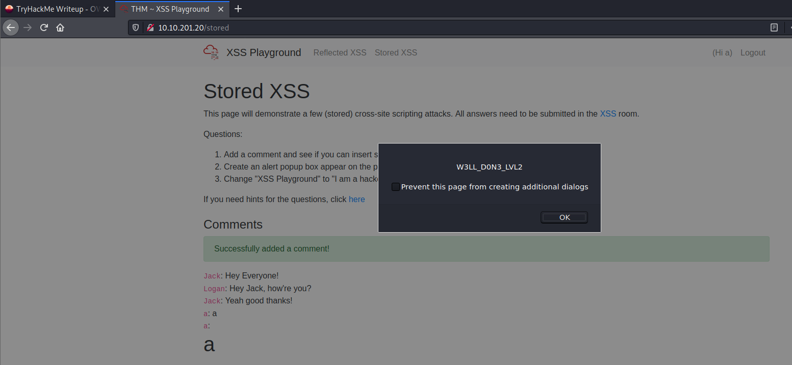

# [OWASP Top 10](https://tryhackme.com/room/owasptop10)
---
---
---
---
---
Learn about and exploit each of the OWASP Top 10 vulnerabilities; the 10 most critical web security risks.

## [Severity 1] Command Injection Practical
---
---
---
#### Answer
What strange text file is in the website root directory?
<figure>
<center><a href="1.png"></a></center>
<figcaption>Execute `ls` command.</figcaption>
</figure>
It's **drpepper.txt**.

How many non-root/non-service/non-daemon users are there?
<figure>
<center><a href="2.png"></a></center>
<figcaption>Cat the passwd file.</figcaption>
</figure>
There is **0** non-root/non-service/non-daemon users. We can see if there is an user that starts from uid 1000.

What user is this app running as?
<figure>
<center><a href="3.png"></a></center>
<figcaption>Execute `whoami` command.</figcaption>
</figure>
It's **www-data**.

What is the user's shell set as?
<figure>
<center><a href="4.png"></a></center>
<figcaption>Cat the `passwd` file.</figcaption>
</figure>
It's **/usr/sbin/nologin**.

What version of Ubuntu is running?
<figure>
<center><a href="5.png"></a></center>
<figcaption>Execute `lsb_release -a` command.</figcaption>
</figure>
It's **18.04.4**.

Print out the MOTD.  What favorite beverage is shown?
<figure>
<center><a href="6.png"></a></center>
<figcaption>Cat the `/etc/update-motd.d/00-header` file.</figcaption>
</figure>
It's **dr pepper**.

## [Severity 2] Broken Authentication Practical
---
---
---
#### Answer
What is the flag that you found in darren's account?
<figure>
<center><a href="7.png"></a></center>
<figcaption>Logged in as ` darren`.</figcaption>
</figure>
Register as user ` darren` (with space in front) and we got the flag. It's **fe86079416a21a3c99937fea8874b667**.

Now try to do the same trick and see if you can login as arthur.
<figure>
<center><a href="8.png"></a></center>
<figcaption>Logged in as ` arthur`.</figcaption>
</figure>

What is the flag that you found in arthur's account?
- It's **d9ac0f7db4fda460ac3edeb75d75e16e**.

## [Severity 3] Sensitive Data Exposure (Challenge)
---
---
---
#### Answer
What is the name of the mentioned directory?
<figure>
<center><a href="9.png"></a></center>
<figcaption>`assets` directory listing.</figcaption>
</figure>
- View the website source code and there is an image that point to `assets/images/lake-taupo.jpg`. Go to that link and go to the first directory, `assets`. We can see there is a directory listing there plus the webapp database. So the name of the mentioned directory is **/assets**.

Navigate to the directory you found in question one. What file stands out as being likely to contain sensitive data?
- From the picture earlier, it's **webapp.db**.

Use the supporting material to access the sensitive data. What is the password hash of the admin user?
- Download the `webapp.db` file first, then open it wih `sqlite3`.
```bash
$ sqlite3 webapp.db                                              
SQLite version 3.33.0 2020-08-14 13:23:32
Enter ".help" for usage hints.
sqlite> .tables
sessions  users   
sqlite> select * from users
   ...> ;
4413096d9c933359b898b6202288a650|admin|6eea9b7ef19179a06954edd0f6c05ceb|1
23023b67a32488588db1e28579ced7ec|Bob|ad0234829205b9033196ba818f7a872b|1
4e8423b514eef575394ff78caed3254d|Alice|268b38ca7b84f44fa0a6cdc86e6301e0|0
```
The admin's hashed password is **6eea9b7ef19179a06954edd0f6c05ceb**.

Crack the hash. What is the admin's plaintext password?
<figure>
<center><a href="10.png"></a></center>
<figcaption>Cracking the hash.</figcaption>
</figure>
- We can use [Crackstation](https://crackstation.net/) website to crack that hash. The plaintext password is **qwertyuiop**.

Login as the admin. What is the flag?
<figure>
<center><a href="11.png"></a></center>
<figcaption>Logged in as admin.</figcaption>
</figure>
- It's **THM{Yzc2YjdkMjE5N2VjMzNhOTE3NjdiMjdl}**.

## [Severity 4 XML External Entity - eXtensible Markup Language
---
---
---
#### Answer
Full form of XML
- **eXtensible Markup Language**.

Is it compulsory to have XML prolog in XML documents?
- **no**, XML Prolog is not compulsory to use but it is considered a `good practice` to put that line in all your XML documents.

Can we validate XML documents against a schema?
- **yes**

How can we specify XML version and encoding in XML document?
- **xlm prolog**.

## [Severity 4] XML External Entity - DTD
---
---
---
#### Answer
How do you define a new ELEMENT?
- **!ELEMENT**.

How do you define a ROOT element?
- **!DOCTYPE**.

How do you define a new ENTITY?
- **!ENTITY**.

## [Severity 4] XML External Entity - Exploiting
---
---
---
#### Answer
Try to display your own name using any payload.
<figure>
<center><a href="12.png"></a></center>
<figcaption>Display my name.</figcaption>
</figure>

See if you can read the /etc/passwd.
<figure>
<center><a href="13.png"></a></center>
<figcaption>Display `/etc/passwd` file.</figcaption>
</figure>

What is the name of the user in /etc/passwd
- **falcon**.

Where is falcon's SSH key located?
- **/home/falcon/.ssh/id_rsa**.

What are the first 18 characters for falcon's private key
<figure>
<center><a href="14.png"></a></center>
<figcaption>Falcon's private key.</figcaption>
</figure>
- **MIIEogIBAAKCAQEA7b**.

## [Severity 5] [Severity 5] Broken Access Control (IDOR Challenge)
---
---
---
#### Answer
Read and understand how IDOR works. Deploy the machine and go to [http://10.10.61.2](http://10.10.61.2) - Login with the username being noot and the password test1234.
<figure>
<center><a href="15.png"></a></center>
<figcaption>Logged is as `noot`!</figcaption>
</figure>

Look at other users notes. What is the flag?
<figure>
<center><a href="16.png"></a></center>
<figcaption>Flag!</figcaption>
</figure>
- Go to [this](http://10.10.61.2/note.php?note=0) link and we got the flag. It's **flag{fivefourthree}**.

## [Severity 6] Security Misconfiguration
---
---
---
#### Answer
Deploy the VM and hack into the webapp, and find the flag!
<figure>
<center><a href="16.png"></a></center>
<figcaption>Logged in as defaul pensive credential.</figcaption>
</figure>
- We found the default credential on [here](https://github.com/NinjaJc01/PensiveNotes). Then we got the flag, **thm{4b9513968fd564a87b28aa1f9d672e17}**.

## [Severity 7] Cross-site Scripting
---
---
---
#### Answer
Deploy the VM and navigate to http://10.10.201.20/ in your browser and click on the "Reflected XSS" tab on the navbar; craft a reflected XSS payload that will cause a popup saying "Hello".
<figure>
<center><a href="17.png"></a></center>
<figcaption>alert("Hello").</figcaption>
</figure>

- And then we clicked OK:
<figure>
<center><a href="18.png"></a></center>
<figcaption>Afer we clicked OK.</figcaption>
</figure>
- It's **ThereIsMoreToXSSThanYouThink**.

On the same reflective page, craft a reflected XSS payload that will cause a popup with your machines IP address.
<figure>
<center><a href="19.png"></a></center>
<figcaption>alert(window.location.hostname).</figcaption>
</figure>

And then we clicked OK:
<figure>
<center><a href="18.png"></a></center>
<figcaption>Afer we clicked OK.</figcaption>
</figure>
- It's **ReflectiveXss4TheWin**.

Now navigate to http://10.10.201.20/ in your browser and click on the "Stored XSS" tab on the navbar; make an account. Then add a comment and see if you can insert some of your own HTML.
<figure>
<center><a href="21.png"></a></center>
<figcaption>Using `header html tag` as input.</figcaption>
</figure>
- We got a flag, it's **HTML_T4gs**.

On the same page, create an alert popup box appear on the page with your document cookies.
<figure>
<center><a href="22.png"></a></center>
<figcaption>alert(document.cookie).</figcaption>
</figure>

- And then we clicked OK:
<figure>
<center><a href="23.png"></a></center>
<figcaption>Afer we clicked OK.</figcaption>
</figure>
- It's **W3LL_D0N3_LVL2**.

Change "XSS Playground" to "I am a hacker" by adding a comment and using Javascript.
<figure>
<center><a href="24.png"></a></center>
<figcaption>XSS'ed!</figcaption>
</figure>
- I use this payload:
```html
<script>
document.getElementById("thm-title").innerHTML = "I am a hacker";
</script>
```
- And i got the flag, **websites_can_be_easily_defaced_with_xss**.

## [Severity 8] Insecure Deserialization
---
---
---
#### Answer
Who developed the Tomcat application?
- **the apache software foundation**.

What type of attack that crashes services can be performed with insecure deserialization?
- **denial of service**.

## [Severity 8] Insecure Deserialization - Objects
---
---
---
#### Answer
Select the correct term of the following statement:<br>
If a dog was sleeping, would this be:<br>
A) A State<br>
B) A Behaviour 
- **a behaviour**.

## [Severity 8] Insecure Deserialization - Deserialization
---
---
---
#### Answer
What is the name of the base-2 formatting that data is sent across a network as? 
- **binary**.

## [Severity 8] Insecure Deserialization - Cookies
---
---
---
#### Answer
If a cookie had the path of `webapp.com/login` , what would the URL that the user has to visit be?
- **webapp.com/login**.

What is the acronym for the web technology that Secure cookies work over?
- **HTTPS**.

## [Severity 8] Insecure Deserialization - Cookies Practical
---
---
---
#### Answer
1st flag (cookie value).
- Register and login. Decode the base64 encoded cookie, which is sessionId. Then we got the flag!
```bash
$ echo "gAN9cQAoWAkAAABzZXNzaW9uSWRxAVggAAAAZTdmZWIyNTAxMTNhNGQzMmJiY2I3NzUwODJjN2RjZTFxAlgLAAAAZW5jb2RlZGZsYWdxA1gYAAAAVEhNe2dvb2Rfb2xkX2Jhc2U2NF9odWh9cQR1Lg==" | base64 -d
�}q(X   sessionIdqX e7feb250113a4d32bbcb775082c7dce1qX
                                                      encodedflagqX▒THM{good_old_base64_huh}qu.                
```
- The flag is **THM{good_old_base64_huh}**.

2nd flag (admin dashboard)
- Change our userType cookie from `user` to `admin` and refresh the page.
<figure>
<center><a href="25.png"></a></center>
<figcaption>Admin's cookie!</figcaption>
</figure>
- The flag is **THM{heres_the_admin_flag}**.

## [Severity 8] Insecure Deserialization - Code Execution
---
---
---
#### Answer
flag.txt?
```bash
$ cd ~
$ ls
app
flag.txt
launch.log
$ cat flag.txt
4a69a7ff9fd68
```
- The flag is **4a69a7ff9fd68**.

## [Severity 8] Insecure Deserialization - Code Execution
---
---
---
#### Answer
How many characters are in /etc/passwd (use wc -c /etc/passwd to get the answer)
- **1611**. You can use [this](https://www.exploit-db.com/exploits/47922) exploit.

## [Severity 10] Insufficient Logging and Monitoring
---
---
---
#### Answer
What IP address is the attacker using?
- **49.99.13.16**.

What kind of attack is being carried out?
- **Brute force**.
